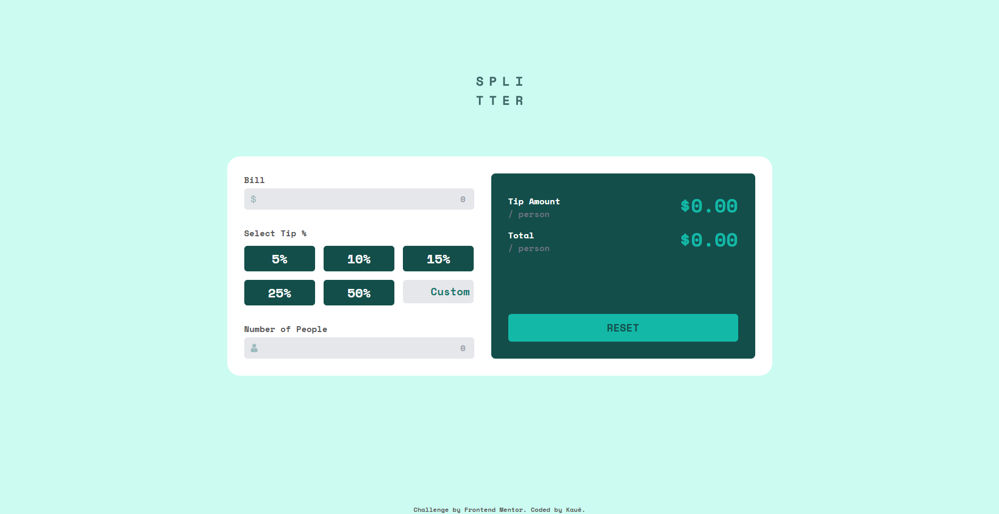

# Frontend Mentor - Tip calculator app solution

This is a solution to the [Tip calculator app challenge on Frontend Mentor](https://www.frontendmentor.io/challenges/tip-calculator-app-ugJNGbJUX). Frontend Mentor challenges help you improve your coding skills by building realistic projects.

## Table of contents

- [Screenshot](#screenshot)
- [Links](#links)
- [Built with](#built-with)
- [Author](#author)

### Screenshot

### Links

- Solution URL: [Click here](https://github.com/kauevecchia/tip-calculator)
- Live Site URL: [Click here](https://kauevecchia.github.io/tip-calculator/)

### Built with

- HTML5
- TailwindCSS
- JavaScript
- Flexbox
- CSS Grid
- Mobile-first workflow

## Author

- Website - [Kauê](https://github.com/kauevecchia)
- Frontend Mentor - [@kauevecchia](https://www.frontendmentor.io/profile/kauevecchia)

